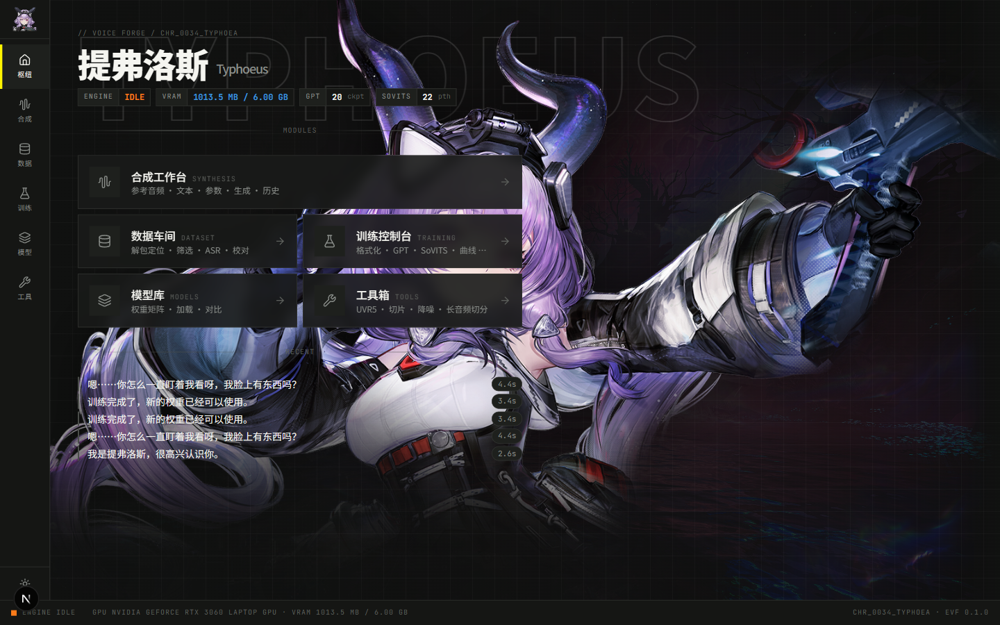
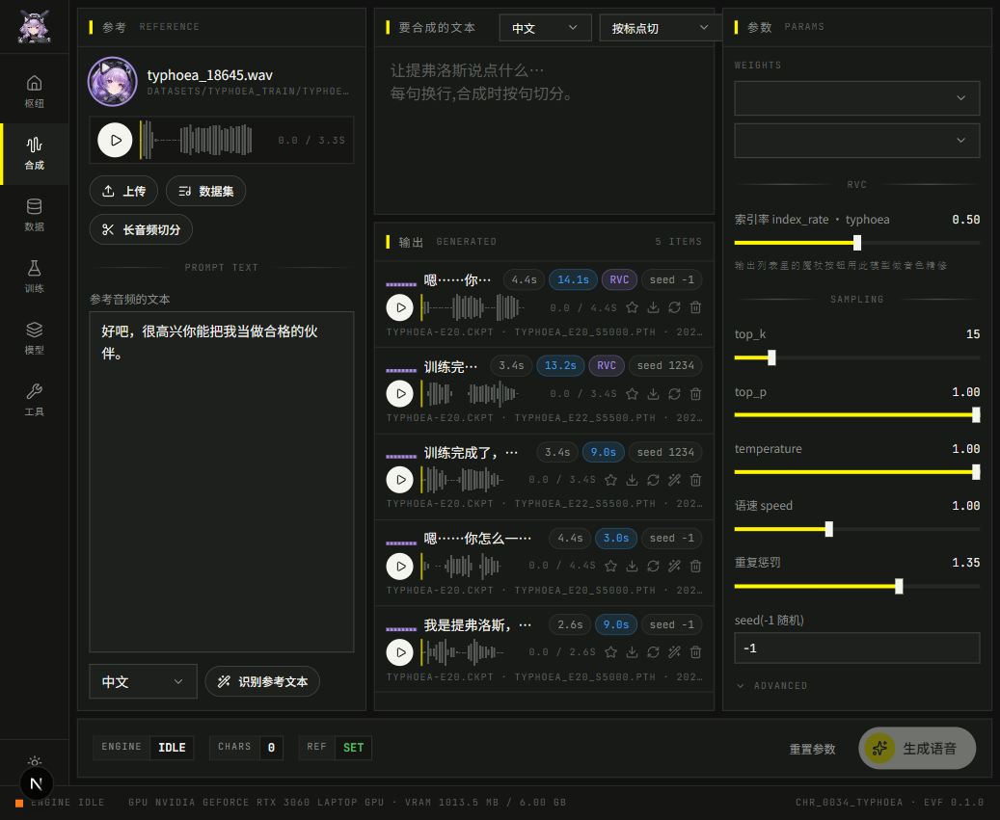
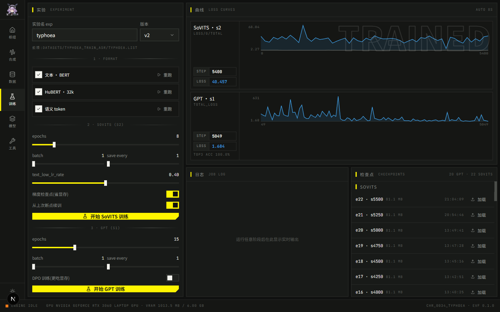

# EndfieldVoiceForge

《明日方舟：终末地》角色语音克隆工作台。数据准备 → 训练 → 调参 → 合成 → RVC 精修全流程在一个终末地风格的 Web Studio 里完成；当前角色：**提弗洛斯**（`chr_0034_typhoea`），框架支持多角色。

> 仅用于个人学习。解包素材、训练集、权重、生成音频都不进仓库，仓库只含代码与说明。



## Studio（apps/）

| 页面 | 功能 |
|---|---|
| 枢纽 `/` | 角色立绘、引擎 / 显存 / 权重状态、模块入口、最近生成 |
| 合成 `/synth` | 参考音频（上传 / 数据集挑选 / 长音频切分 + ASR）、文本、全部 GPT-SoVITS 推理参数、生成历史（波形试听 / 收藏 / 下载 / 以此为参考 / RVC 精修） |
| 数据 `/data` | 解包定位 → 筛选 → ASR → 校对 管线节点，样本矩阵，打标编辑器（↑↓ 切换、Ctrl+S 保存） |
| 训练 `/train` | 数据格式化 1a/1b/1c、SoVITS(s2) / GPT(s1) / RVC 训练参数与断点续训、实时 loss 曲线、作业日志、checkpoint 列表一键加载 |
| 模型 `/models` | 权重矩阵（exp × epoch）、加载 / 删除、A/B 试听、RVC 小模型导出 / 建索引 |
| 工具 `/tools` | RVC 音色转换（任意人声 → 提弗洛斯，呻吟/喘息等非语言人声走这里）、UVR5 人声分离、切片、降噪、批量 ASR |
| 指南 `/guide` | 全部参数的新手说明（每个参数旁的 ? 图标悬浮也能看到）、常见问题 |




- `apps/server`：FastAPI（端口 9890），进程内常驻 GPT-SoVITS `TTS` 引擎；训练 / 工具类任务走子进程 + SSE 日志流；生成历史存 sqlite
- `apps/web`：Next.js 16 + React 19 + Tailwind v4；视觉遵循终末地设计语言（烟灰底 / 信号黄行动色 / 直角与切角 / 角括号选中 / 幽灵字），角色主题色由 `characters/*.json` 注入
- 解包素材经 `scripts/sync_assets.py` 按 `assets.manifest.json` 拷入 `assets/`（gitignore），server 以 `/assets` 挂载

### 启动 / 退出

**最简单的方式（推荐）**：双击项目根目录的 `start.bat`（或桌面的 `EndfieldVoiceForge` 快捷方式），会自动：
1. 首次自动同步素材（`assets/characters` 不存在时）
2. 开两个**独立窗口**分别跑 server(9890) + web(3000)
3. 6 秒后自动打开浏览器 http://localhost:3000

关掉 Trae / 关掉启动用的命令行窗口都**不影响**已启动的服务（它们是独立进程）。

**退出**：双击 `stop.bat`，按端口 9890 / 3000 精准停掉 server 和 web，不误杀其他程序。或者直接关闭那两个服务窗口。

**手动方式（等价）**：

```powershell
python scripts/sync_assets.py         # 首次：从 EndfieldUnpacker/_fullmap 拷素材
cd apps/web && pnpm install && cd ../..
scripts/dev.ps1                       # 起 server(9890) + web(3000)
```

**训练中也能合成**：开始训练（GPT-SoVITS s1/s2 或 RVC）时会自动把 TTS 推理引擎切到 CPU，释放显存给训练用；此时仍可打文本生成语音，只是 CPU 推理较慢（几秒音频可能十几秒到一两分钟）。训练结束后下次合成会自动切回 CUDA 满速。

6 GB 显卡注意：训练前 server 会把推理引擎切到 CPU 以释放显存；上游 s2 训练 DataLoader 默认 5 worker + pinned memory 在 16 GB 主机上会 OOM，`patches/` 里改成由 `GSV_NUM_WORKERS` / `GSV_PIN_MEMORY` 控制，server 传 2 / 0。主机可用内存 < 4 GB 时训练接口拒绝启动。

## 现状（2026-09-18）

| 路线 | 状态 | 效果 / 备注 |
|---|---|---|
| **GPT-SoVITS v2 微调** | 已训 22 epoch，可推理 | 目前最可用；Studio 训练页可续训 |
| GPT-SoVITS 原版推理页 | 备用 | Studio 上线后仅作对照，见 `patches/` |
| IndexTTS-2.5 零样本 | 跑通 | RTX 3060 6GB 上 RTF≈87（3s 音频要 270s），只能试听 |
| RVC v2 音色转换 | e20 / 200（DeepSeek 中断处），已导出小模型 + 索引，训练页可续训 | 合成后处理 + 非语言人声转换，一句约 15 s |

训练集：254 条提弗洛斯中文台词，共 23.6 分钟，全部带官方台词文本（来自 ASR + `AudioDialog` 校对）。

## 目录

```
EndfieldVoiceForge/
├── config.py                 所有路径集中在这里；依赖同级的 EndfieldUnpacker
├── apps/server/              FastAPI 后端（core/: tts_engine, jobs, gsv, rvc, tfevents, library; routers/）
├── apps/web/                 Next.js 前端（app/ 六个页面, components/ef 终末地组件层）
├── characters/typhoea.json   角色定义：名称 / 主题色 / 立绘 / 数据集 / 默认权重 / 默认参考
├── assets.manifest.json      需要的解包 PNG 清单；scripts/sync_assets.py 按它拷贝
├── pipeline/                 数据管线（按序号执行）
│   ├── 01_measure_externals.py   解密 PCK externals 区，量每条 wem 时长并缓存
│   ├── 02_select_speech.py       按台词时长找最近邻 wem，解码并量 F0 / 有声比
│   ├── 03_extract_train.py       按 F0 180-350Hz 等条件筛出训练集 wav
│   ├── 04_postprocess_list.py    规范 ASR 输出的 .list 为训练格式
│   ├── build_ref.py              抠指定台词拼零样本参考音频
│   └── export_vad.py             （早期路线）全量 wem + Silero VAD 筛人声，已弃用
├── gsv_train.py / gsv_infer.py   GPT-SoVITS v2 训练 / 推理编排
├── rvc_train.py                  RVC 训练编排
├── indextts_clone.py             IndexTTS 零样本克隆
├── patches/                      对 gpt-sovits 源码的改动（单卡训练修复、推理页增强），clone 上游后 git apply
├── third_party/   (gitignore)   gpt-sovits@48b1a01、RVC@81eed5e、index-tts@ee40fa7 各自 clone + venv + 权重
├── datasets/      (gitignore)   typhoea_train/（wav）、typhoea_train_asr/typhoea.list、cache/
└── outputs/       (gitignore)   生成音频
```

## 环境

- Windows 11，RTX 3060 Laptop 6GB
- `third_party/index-tts/.venv`：Python 3.11 + torch 2.8 cu128，**同时给 GPT-SoVITS 用**
- `third_party/RVC/.venv`：Python 3.12 + torch 2.7 cu128
- 外部依赖：同级目录的 [EndfieldUnpacker](https://github.com/LinXingjian365/EndfieldUnpacker)（AKPK 解密逻辑、`DecryptOutput/`、vgmstream）。路径不同时设环境变量 `ENDFIELD_UNPACKER_DIR`

third_party 与 datasets 不进 git，换机器需按上面版本重新 clone 引擎、跑一遍 pipeline。

## 用法

```powershell
# 数据管线（需 EndfieldUnpacker 已解包出 DecryptOutput/Audio 与 TableCfg_json）
python pipeline/01_measure_externals.py
python pipeline/02_select_speech.py
python pipeline/03_extract_train.py
# 用 GPT-SoVITS WebUI 的 ASR 工具对 datasets/typhoea_train 打标 -> typhoea_train.list，然后
python pipeline/04_postprocess_list.py

# GPT-SoVITS 微调 + 推理
third_party/index-tts/.venv/Scripts/python.exe gsv_train.py preprocess
third_party/index-tts/.venv/Scripts/python.exe gsv_train.py s1
third_party/index-tts/.venv/Scripts/python.exe gsv_train.py s2
third_party/index-tts/.venv/Scripts/python.exe gsv_infer.py

# RVC
python rvc_train.py all

# IndexTTS 零样本
third_party/index-tts/.venv/Scripts/python.exe indextts_clone.py

# GPT-SoVITS 推理页（端口 9872，启动即加载微调权重）
cd third_party/gpt-sovits
..\index-tts\.venv\Scripts\python.exe GPT_SoVITS/inference_webui.py
```

## 关键发现（详见 [LESSONS.md](LESSONS.md)）

- 正式版 VFS 里语音和音效混在一起，`AudioDialog.json` 的 key 只有 6% 能用 FNV-1 反查到 wem 名，**不能靠哈希定位**
- 真正可用的定位方式：中文语音流 `default_chinese_stream.pck` 的 **externals 区** + `wavDuration` 最近邻匹配 + F0 过滤
- 全量 wem 里 97% 是环境音，任何"时长匹配"都必须先过 VAD 或 F0 检查
